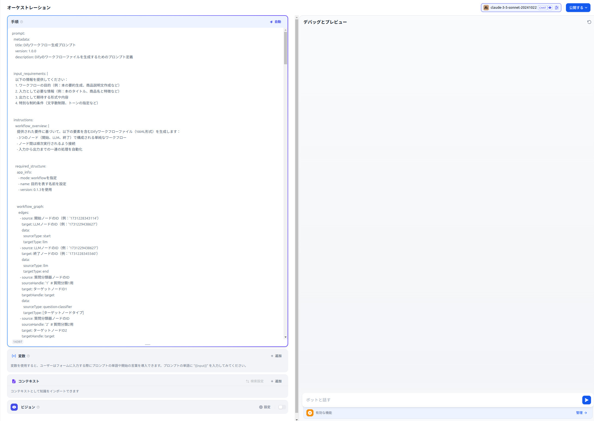
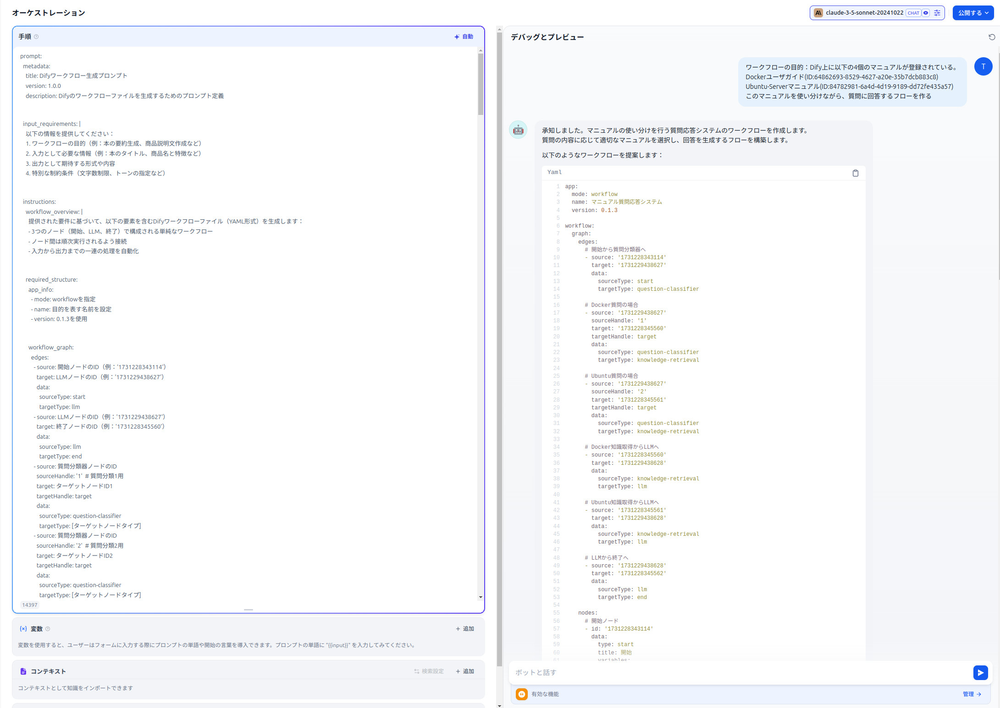
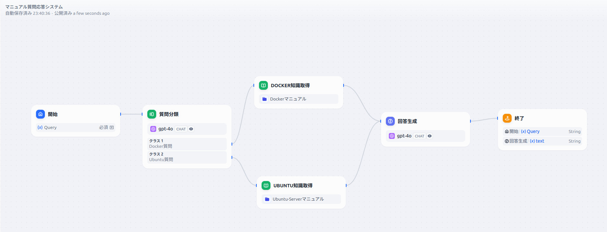

# Dify 工作流生成器提示词

## 概述

本仓库为[Dify](https://dify.ai)提供工作流生成的提示词定义。您可以按照YAML格式编写的详细提示词规范，创建适用于各种用例的工作流。

## 特点

- 使用三个基本节点（开始、LLM、结束）生成简单工作流
- 支持高级功能节点类型：
  - 问题分类器
  - 知识检索
  - HTTP请求
  - JSON解析
  - IF/ELSE节点
  - 代码节点
  - 变量聚合器节点

## 文件内容

- workflow_generator_prompt.yml
  - 工作流生成提示词定义
- dify_chatbot/DifyWorkflowGeneate.yml
  - 应用了workflow_generator_prompt.yml的Dify聊天机器人
- example/manual_search.yml
  - 工作流生成示例

## 使用方法

1. 克隆仓库：
```
https://github.com/Tomatio13/DifyWorkFlowGenerator.git
```
2. 将工作流生成提示词dify_chatbot/DifyWorkflowGeneate.yml导入到Dify中。
导入后，您将看到如下界面：


*注意*：请使用claude-3-5-sonnet而不是gpt-4o运行此提示词。使用gpt-4o无法正确生成工作流。

3. 准备必要信息：
   - 工作流目的
   - 如果使用知识控制块，请查找dataset_ids：
        - 查找方法：
            创建包含知识的工作流。
            导出创建的工作流的DSL。
            ```yml
            type: knowledge-retrieval
            title: Ubuntu知识获取
            dataset_ids:
                - 84782981-6a4d-4d19-9189-dd72fe435a57
            retrieval_mode: multiple
            ```
            如上所示记录dataset_ids。

4. 按照下图所示创建并执行提示词：

将生成如图所示可导入Dify的YAML文件。
5. 将生成的YAML复制到单独的文件中，并导入到Dify中。
6. 以下是导入example/manual_search.yml后的界面：


## 示例
example/adviser_bot.yml
  - 使用问题分类器、知识检索、IF/ELSE分支、模板转换和参数提取的工作流


## 支持的节点类型

### 基本节点
- 开始节点：接收用户输入
  - 文本输入（短文本/段落）
  - 数值输入
  - 文件输入（文档、图片、音频、视频）
- LLM节点：使用OpenAI GPT-4处理
- 结束节点：输出结果

### 扩展节点
- HTTP请求节点：外部API集成
- JSON解析节点：JSON处理
- 问题分类器节点：输入分类
- 知识检索节点：从数据集搜索信息
- IF/ELSE节点：条件分支
- 代码节点：Python代码执行
- 变量聚合器节点：聚合多个节点的输出
- 文档提取器节点：从文档中提取文本
- 模板转换节点：基于模板的字符串生成
- 答案节点：响应输出控制
- 参数提取器节点：从文本中提取参数
- YouTube字幕节点：获取YouTube视频字幕
- JinaReader节点：提取网页内容
- TavilySearch节点：执行网络搜索

## 工作流示例

### 简单处理流程
```yaml
开始 → LLM → 结束
```

### 包含分支的流程
```yaml
开始 → 问题分类器 → 知识检索 → LLM → 结束
                  → 知识检索 → LLM → 结束
```

### IF/ELSE分支流程
```yaml
开始 → IF/ELSE → LLM(True) → 结束
             → LLM(False) → 结束
```

### 变量聚合流程
```yaml
开始 → LLM1 → 变量聚合器 → 结束
    → LLM2 ↗
```

### 文档处理流程
```yaml
开始(文件输入) → 文档提取器 → LLM → 结束
```

### 模板转换流程
```yaml
开始 → 模板转换 → LLM → 结束
```

### 复合处理流程
```yaml
开始(文件) → 文档提取器 → 模板转换 → LLM → 结束
```

### 响应控制流程
```yaml
开始 → LLM → 答案 → 结束
```

### 复合响应流程
```yaml
开始 → LLM1 → 模板转换 → 答案 → 结束
    → LLM2 ↗
```

### 参数提取流程
```yaml
开始 → 参数提取器 → LLM → 结束
```

### 复合参数处理流程
```yaml
开始 → 参数提取器 → 模板转换 → 答案 → 结束
```

### YouTube字幕流程
```yaml
开始 → YouTube字幕 → LLM → 结束
```

### 网页内容处理流程
```yaml
开始 → JinaReader → LLM → 结束
```

### 网络搜索流程
```yaml
开始 → TavilySearch → LLM → 结束
```

### 复合媒体处理流程
```yaml
开始 → YouTube字幕 → 模板转换 → LLM → 结束
    → JinaReader → ↗
```

## 限制条件

- 仅支持OpenAI的gpt-4o模型（请在Dify界面上更改模型设置）
- 代码节点不支持布尔类型（使用数字类型的0/1）
- 文件输入仅支持以下格式：
  - 文档（PDF、Word等）
  - 图片（JPG、PNG等）
  - 音频（MP3、WAV等）
  - 视频（MP4等）
- 模板转换节点限制：
  - 输出始终为字符串类型
  - 仅支持Jinja2模板语法
  - 不建议使用复杂的控制语法
- 答案节点限制：
  - 不支持arrayObject类型变量
  - 聊天模式下有特殊行为
  - 变量引用仅支持{{#节点ID.变量名#}}格式
- 参数提取器节点限制：
  - 参数名必须唯一
  - 必须提取必需参数
  - 图像处理仅支持兼容模型
  - 推理模式仅限于prompt或function_call
- 不支持的节点：
  - 迭代节点
  - 变量赋值节点
  - 列表处理
  - 工具节点
- YouTube字幕节点限制：
  - 仅支持公开视频
  - 仅适用于有字幕的视频
  - 需要指定语言的字幕
- JinaReader节点限制：
  - 仅支持可访问的网页
  - JavaScript动态内容可能无法完全获取
  - 可能需要代理设置
- TavilySearch节点限制：
  - 搜索结果数量有限（最多10个）
  - 某些域名可能有访问限制
  - 搜索深度影响处理时间
- TavilySearchノードの制約：
## 关于difyDslGenCheck.py
*注意*：这是一个实验性功能，可能经常无法生成工作流。请使用Dify的工作流生成功能。
### 功能
- 基于工作流概述生成DSL文件
- 检查生成的DSL文件结构是否正确
- 根据检查结果修改DSL文件


### 使用方法
1. 在difyDslGenCheck.py中描述您想要生成的工作流概述：

```python
    wanted_workflow = """
    Prompt:
    目的：一个像旅行顾问一样研究目的地信息的工具
    1. 获取目的地名称作为输入信息。
    2. 搜索互联网并获取3个包含该目的地旅游和美食信息的URL。
    3. 从这3个URL中检索信息。并行处理这3个URL。
    4. 将从3个URL获得的信息输入到LLM中，整理目的地信息并输出。输出应格式化为适合在旅游杂志上发表的文章。
    """
```
2. 执行脚本：
```bash
export ANTHROPIC_API_KEY="your_anthropic_api_key"
python -m venv dify_env
source dify_env/bin/activate
pip install -r requirements.txt
python difyDslGenCheck_ch.py
```

## 许可证

MIT许可证

## 贡献

欢迎提交拉取请求和问题报告。

## 相关链接

- [Dify官方网站](https://dify.ai)
- [Dify文档](https://docs.dify.ai) 
